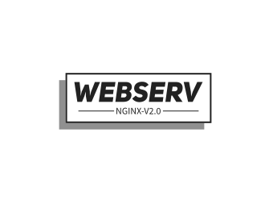

  

<h1 align="center"> <b><i>WEBSERVER</i></b> </h1>

 
<!--  -->

 

  <b>
    This project is about writing we own HTTP server. 
    You will be able to test it with an actual browser. 
    HTTP is one of the most used protocols on the internet. 
    Knowing its arcane will be useful, even if you won’t be working on a website. 
  </b>

---

## 📝 Table of Contents

- [About](#about)
- [Getting Started](#getting_started)
- [Deployment](#deployment)
- [Usage](#usage)
- [Built Using](#built_using)
- [TODO](../TODO.md)
- [Contributing](../CONTRIBUTING.md)
- [Authors](#authors)
- [Acknowledgments](#acknowledgement)

## 🧐 About 

This project is about writing we own HTTP server using C++, 
You will be able to test it with an actual browser.
HTTP is one of the most used protocols on the internet.
Knowing its arcane will be useful, even if you won’t be working on a website.

## 🏁 Getting Started 

## 🔗 RESOURSES <a name = "resourses">

- <a href="https://www.digitalocean.com/community/tutorials/understanding-nginx-server-and-location-block-selection-algorithms"> understanding nginx server and location block selection algorithms </a>

- <a href="http://nginx.org/en/docs/http/request_processing.html#:~:text=In%20this%20configuration%20nginx%20tests,default%20server%20for%20this%20port."> How nginx processes a request </a>
